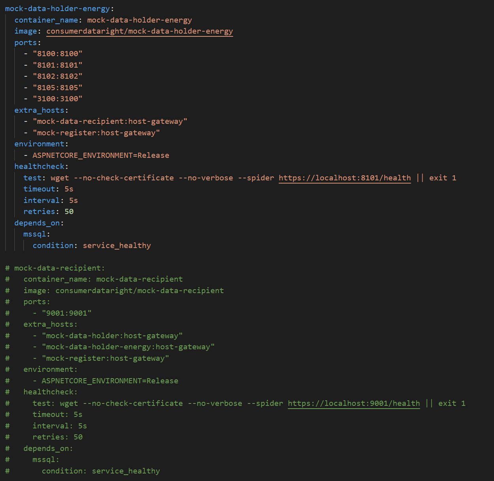
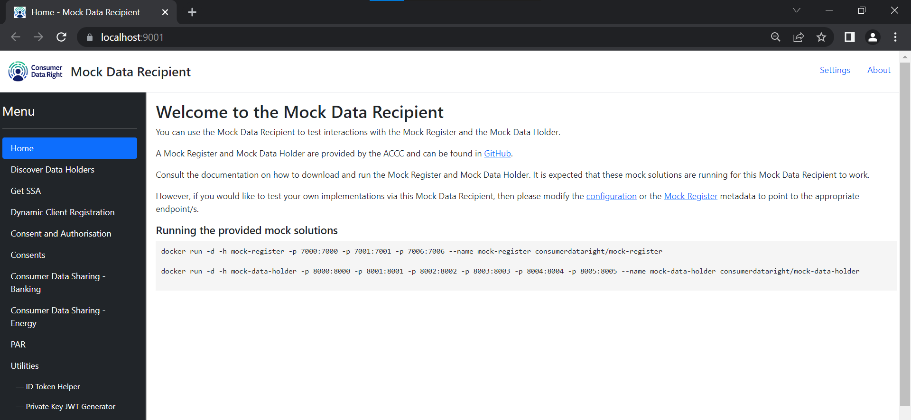

# Use the pre-built image

The Mock Data Holder image is available on [Docker Hub](https://hub.docker.com/r/consumerdataright/mock-data-holder).

There are a number of ways that this image can be used.

## Pull the Mock Data Holder Banking and Energy images from Docker Hub

Run the following command to pull the latest Banking Mock Data Holder image from Docker Hub:

```
docker pull consumerdataright/mock-data-holder
```

You can also pull a specific image by supplying a tag, such as the name of the branch ("main" or "develop") or a release number:

```
# Pull the image from the main branch
docker pull consumerdataright/mock-data-holder:main

# Pull the 0.5.0 version of the image
docker pull consumerdataright/mock-data-holder:0.5.0
```
Note: The default 'mock-data-holder' image is a Banking Mock Data Holder.

Run the following command to pull the latest Energy Mock Data Holder image from Docker Hub:

```
docker pull consumerdataright/mock-data-holder-energy
```

You can also pull a specific image by supplying a tag, such as the name of the branch ("main" or "develop") or a release number:

```
# Pull the image from the main branch
docker pull consumerdataright/mock-data-holder-energy:main

# Pull the 0.5.0 version of the image
docker pull consumerdataright/mock-data-holder-energy:0.5.0
```
## Run a multi-container Mock CDR Ecosystem

Multiple containers can be run concurrently to simulate a CDR ecosystem.  The [Mock Register](https://github.com/ConsumerDataRight/mock-register), [Mock Data Holder](https://github.com/ConsumerDataRight/mock-data-holder), [Mock Data Holder Energy](https://github.com/ConsumerDataRight/mock-data-holder-energy) and [Mock Data Recipient](https://github.com/ConsumerDataRight/mock-data-recipient) containers can be run by using the `docker-compose.yml` file.

The Mock CDR Ecosystem relies on SQL Server for data persistence so the container has a dependency on the SQL Server container image provided by Microsoft.

In order to run the Mock CDR Ecosystem and related SQL Server instance, use the provided `docker-compose.yml` file.

```
# Navigate to the Source directory where the docker-compose.yml file is located.
cd .\Source\DockerCompose

# Run the Mock CDR Ecosystem and SQL Server containers.
docker-compose up -d

# When finished, stop the containers.
docker-compose down
```
### Note: EULA for SQL Server
The `docker-compose.yml` file utilises the Microsoft SQL Server Image from Docker Hub. The Microsoft EULA for the Microsoft SQL Server Image must be accepted to continue.
Set the `ACCEPT_EULA` environment variable to `Y` within the `docker-compose.yml` if you accept the EULA.
See the [Microsoft SQL Server Image](https://hub.docker.com/_/microsoft-mssql-server) on Docker Hub for more information.

Example of accepting the `ACCEPT_EULA` environment variable of the SQL Server container.
```
  mssql:
    container_name: sql1
    image: 'mcr.microsoft.com/mssql/server:2022-latest'
    ports:
      - '1433:1433'
    environment:
      - ACCEPT_EULA=Y
```

### Note: Mock host names

Each Mock solution has a default host name, as per below:

| Mock solution           | Default host name       |
|-------------------------|-------------------------|
| Mock Register           | mock-register           |
| Mock Data Holder        | mock-data-holder        |
| Mock Data Holder Energy | mock-data-holder-energy |
| Mock Data Recipient     | mock-data-recipient     |

To resolve these host names, each of these host names can be registered in the local machine's `hosts` file (located in C:\Windows\System32\drivers\etc\).

```
127.0.0.1   mock-register
127.0.0.1   mock-data-holder
127.0.0.1   mock-data-holder-energy
127.0.0.1   mock-data-recipient
127.0.0.1   mssql
```

### Switching out a container in the multi-container Mock CDR Ecosystem with your own solution

You can switch out one of the mock solutions running in the multi-container Mock CDR Ecosystem with a mock solution running in MS Visual Studio or with your own solution.

Within the `docker-compose.yml` file, comment out the solution that you do not want to be started. E.g. The Mock Data Recipient:

[](./images/mdr-switch-out-compose-comment.png)

Start the Mock CDR Ecosystem using the docker compose file.
```
# Run the Mock CDR Ecosystem containers.
docker-compose -f docker-compose.yml up -d
```

In this example we will be switching out our Mock Data Recipient. 
Clone the [Mock Data Recipient](https://github.com/ConsumerDataRight/mock-data-recipient) repository from GitHub and open the solution in MS Visual Studio.  

Build and run the Mock Data Recipient in MS Visual Studio. Our switched out Mock Data Recipient solution will now be running. This will result in the Mock Data Recipient running in MS Visual Studio, connected to the Mock Register and the Mock Data Holders running in docker.

[](./images/mdr-switch-out-running.png)

For more details on how to run a mock solution in MS Visual Studio see [help guide](../debugging/HELP.md).

## Build and run Mock Data Holder Banking and Mock Data Holder Energy container
A Mock Data Holder Docker image can also be built and run as a Docker container using your local source code.
To build this image, you will also need to clone the [Authorisation Server](https://github.com/ConsumerDataRight/authorisation-server) repository from GitHub.

A PowerShell script is available in the Source directory that can be executed in PowerShell with the command below.
```
.\copy-cdr-auth-server.ps1
```
Build a new docker image for Banking.
```
docker build -f Dockerfile --target Banking -t mock-data-holder .
```

Build a new docker image for Energy.
```
docker build -f Dockerfile --target Energy -t mock-data-holder-energy .
```

Run the SQL Server image.
```
docker run -d -e "ACCEPT_EULA=Y" -e "SA_PASSWORD=Pa{}w0rd2019" -p 1433:1433 --name sql1 -h sql1 -d mcr.microsoft.com/mssql/server:2022-latest
```
Run a new Banking docker container.
```
docker run -d -h mock-data-holder -p 8000:8000 -p 8001:8001 -p 8002:8002 -p 8005:8005 -p 8006:8006 -p 3000:3000 --add-host=mssql:host-gateway --name mock-data-holder mock-data-holder
```
Run a new Energy docker container.
```
docker run -d -h mock-data-holder-energy -p 8100:8100 -p 8101:8001 -p 8102:8102 -p 8105:8105 -p 8106:8106 -p 3100:3100 --add-host=mssql:host-gateway --name mock-data-holder-energy mock-data-holder-energy
```
### Connecting to the MS SQL database container
You can connect to the MS SQL database container from MS SQL Server Management Studio (SSMS) using the following settings:
```
Server type: Database Engine
Server name: mssql 
Authentication: SQL Server Authentication 
Login: sa 
Password: Pa{}w0rd2019 
```

## Host on your own infrastructure
The mock solutions can also be hosted on your own infrastructure, such as virtual machines or kubernetes clusters, in your private data centre or in the public cloud. 
