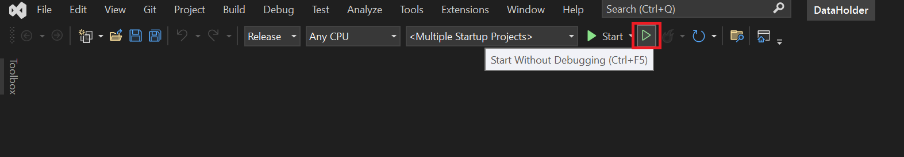

# Getting Started
To get started, clone the source code from the GitHub repositories by following the steps below:

1. Create a folder called CDR.
2. Navigate to this folder.
3. Clone the repo as a subfolder of this folder using the following command:
```
git clone https://github.com/ConsumerDataRight/mock-data-holder.git
```
4. Install the required certificates. See certificate details [here](../../CertificateManagement/README.md "Certificate Management").  
5. Start the projects in the solution. This can be done in multiple ways. This guide explains how to do this using .Net command line and using MS Visual Studio.
6. Clone the Authorisation Server repository as a subfolder of CDR folder using the following command:
```
git clone https://github.com/ConsumerDataRight/authorisation-server.git
```  

## Run solution using .Net command line

1. Download and install the free [MS Windows Terminal](https://docs.microsoft.com/en-us/windows/terminal/get-started "Download the free Windows Terminal here").  

&nbsp;&nbsp;&nbsp;&nbsp;&nbsp;&nbsp;&nbsp;2a. Use the [Start-Data-Holder-Banking](../../Source/Banking/Start-Data-Holder-Banking.bat "Use the Start-Data-Holder-Banking .Net CLI batch file here") batch file to build and run the required projects to start the Mock Data Holder Banking.\
&nbsp;&nbsp;&nbsp;&nbsp;&nbsp;&nbsp;&nbsp;2b. Use the [Start-Data-Holder-Energy](../../Source/Energy/Start-Data-Holder-Energy.bat "Use the Start-Data-Holder-Energy .Net CLI batch file here") batch file to build and run the required projects to start the Mock Data Holder Energy.

[](./images/DotNet-CLI-Running.png)

This will create the LocalDB instance by default and seed the database with the supplied sample data.

LocalDB is installed as part of MS Visual Studio. If using MS VSCode, the MS SQL extension will need to be installed.

You can connect to the database from MS Visual Studio using the SQL Explorer, or from MS SQL Server Management Studio (SSMS) using the following settings:
```
Server type: Database Engine  
Server name: (LocalDB)\\MSSQLLocalDB  
Authentication: Windows Authentication  
```
3. Use the [Start-Auth-Server-Standalone](https://github.com/ConsumerDataRight/authorisation-server/Source/Start-Auth-Server-StandAlone.bat "Use the Start-Auth-Server-StandAlone .Net CLI batch file here") batch file to build and run the required projects to start the Authorisation Server.

An output window will be launched for the Authorisation Server project showing the logging messages as sent to the console. E.g.

[](./images/Debug-using-MS-Visual-AuthServerConsole.png)

## Run solution using MS Visual Studio

There are two Visual Studio solution files that are available for use:
- DataHolder.sln - This is the default solution file that is used primarily for running and debugging the Mock Data Holder projects.
- DataHolder_Shared.sln - In addition to the Mock Data Holder projects, this solution file also opens the [Mock Solutions Test Automation](https://github.com/ConsumerDataRight/mock-solution-test-automation) project. This is useful when wanting to debug or step through source code used in Mock Solution Test Automation project. Further information can be found in [Mock Data Holder Test Automation Execution Guide](../testing/HELP.md)


### Start the Mock Data Holder Banking
To launch the Mock Data Holder Banking solution using MS Visual Studio, the following projects need to be started:
```
CDR.DataHolder.Shared.API.Gateway.mTLS
CDR.DataHolder.Banking.Resource.API
CDR.DataHolder.Public.API
CDR.DataHolder.Manage.API
CDR.DataHolder.Common.API
```

### Start the Mock Data Holder Energy
To launch the Mock Data Holder Energy solution using MS Visual Studio, the following projects need to be started:
```
CDR.DataHolder.Shared.API.Gateway.mTLS
CDR.DataHolder.Energy.Resource.API
CDR.DataHolder.Public.API
CDR.DataHolder.Manage.API
CDR.DataHolder.Common.API
```

The following steps outline describe how to launch the Mock Data Holder solution using MS Visual Studio:

1. Navigate to the solution properties and select a "Start" action for the required projects for Banking or Energy.
    1. Use the Start the Mock Data Holder Banking projects shown above as start up projects in Microsoft Visual Studio to start a Banking Mock Data Holder
    2. Use the Start the Mock Data Holder Energy projects shown above as start up projects in Microsoft Visual Studio to start an Energy Mock Data Holder

2. Click "Start" to start the Mock Data Holder solution.

[](./images/MS-Visual-Studio-Start.png)

Output windows will be launched for each of the projects set to start.
These will show the logging messages as sent to the console in each of the running projects. E.g.

[](./images/MS-Visual-Studio-Running.png)


### Start the Authorisation Server
The Authorisation Server project needs to be running when using the Mock Data Holder. The Authorisation Server can be run in headless mode or headed mode. In headless mode, the Authorisation Server UI is bypassed. If you choose to run in headed mode, the Authorisation Server UI (React application) needs to be started separately to allow for the UI to be displayed.
To accommodate these different modes, the Authorisation Server solution has the following Visual Studio launch profiles:
```
MDH-CdrAuthServer – Run the Authorisation Server in headed mode.
MDH-CdrAuthServerHeadless – Run the Authorisation Server in headless mode.
MDH-CdrAuthServerWorkingWithContainers - Run the Authorisation Server in headed mode and support integration with Docker containers.
```
When running the Authorisation Server in headed mode, follow the instructions [here](https://github.com/ConsumerDataRight/authorisation-server/blob/main/Source/CdrAuthServer.UI/README.md "Authorisation Server UI ReadMe") to start the React application.

1. Open the Authorisation Server solution (cloned to CDR\\Authorisation-Server) in Visual Studio.

2. Select the Visual Studio launch profile you would like to use.

[](./images/MS-Visual-Studio-Select-AuthServer-Launch-Profile.png)

3. Click "Start" to start the Authorisation Server.

[](./images/MS-Visual-Studio-Start-AuthServer.png)

An output window will be launched for the Authorisation Server project showing the logging messages as sent to the console. E.g.

[](./images/Debug-using-MS-Visual-AuthServerConsole.png)


### Debugging using MS Visual Studio

To run the Mock Data Holder in debug mode, simply follow the steps outlined above and click on the "Start" button as shown in the image below:

[](./images/MS-Visual-Studio-Start-Debug.png)
